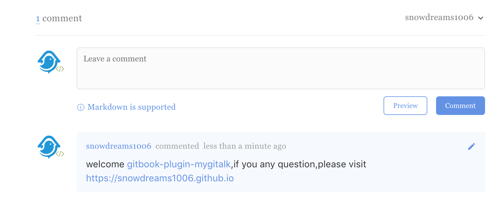

# gitbook-plugin-mygitalk

[![npm][npm-version-image]][npm-version-url] [![cnpm][taonpm-version-image]][taonpm-version-url] [![cnpm-downloads][taonpm-downloads-image]][taonpm-version-url] [![gitbook-version][gitbook-version-image]][gitbook-version-url] [![taonpm-vulnerabilities][taonpm-vulnerabilities-image]][taonpm-vulnerabilities-url]

`Mygitalk` is a **gitbook comment plugin** based on `gitalk`.

If you want to know the story behind `mygitalk`, please visit [gitbook-plugin-mygitalk](https://snowdreams1006.github.io/gitbook-plugin-mygitalk/).



## Usage

- Install this plugin via `npm` or `gitbook` .

Add this plugin to the `book.json` configuration file.

```json
{
    "plugins" : ["mygitalk"]
}
```

Install this plugin via `npm` or `gitbook` .

```bash
$ npm install gitbook-plugin-mygitalk
```

```bash
$ gitbook install
```

- Configure this plugin by applying for `github` authentication.

Add it to your `book.json` with a basic configuration

```json
{
  "pluginsConfig": {
    "mygitalk": {
        "clientID": "GitHub Application Client ID",
        "clientSecret": "GitHub Application Client Secret",
        "repo": "GitHub repo",
        "owner": "GitHub repo owner",
        "admin": ["GitHub repo owner and collaborators, only these guys can initialize github issues"],
        "distractionFreeMode": false
    }
  }
}
```

- Run `gitbook build` or `gitbook serve` to verify this plugin is in effect.

Run `gitbook build` or `gitbook serve` to test this plugin.

- Publish to the production environment to implement the comment function really.
- If you feel this plugin is good, feel free to `star` it.

## Example

The [gitbook-plugin-mygitalk](https://github.com/snowdreams1006/gitbook-plugin-mygitalk) project has been integrated with the plugin itself or you can refer to the [sample project](https://github.com/snowdreams1006/gitbook-plugin-mygitalk/tree/master/example).

## Help

I am very happy to help out with your books or any other questions you might have. 

You can email [me](mailto:snowdreams1006@163.com) or [new issue](https://github.com/snowdreams1006/gitbook-plugin-mygitalk/issues) on github.

## License

`gitbook-plugin-mygitalk` is licensed under `Apache-2.0` License. See [LICENSE](LICENSE) for the full license text.

[npm-version-image]: https://img.shields.io/npm/v/gitbook-plugin-mygitalk.svg?style=flat-square
[npm-version-url]: https://www.npmjs.com/package/gitbook-plugin-mygitalk
[taonpm-version-image]: https://npm.taobao.org/badge/v/gitbook-plugin-mygitalk.svg
[taonpm-version-url]: https://npm.taobao.org/package/gitbook-plugin-mygitalk
[taonpm-downloads-image]: https://npm.taobao.org/badge/d/gitbook-plugin-mygitalk.svg
[gitbook-version-image]: https://badgen.net/badge/gitbook/%3E%3D2.4.3/blue
[gitbook-version-url]: https://www.npmjs.com/package/gitbook
[taonpm-vulnerabilities-image]: https://snyk.io.cnpmjs.org/test/npm/gitbook-plugin-mygitalk/badge.svg
[taonpm-vulnerabilities-url]: https://snyk.io.cnpmjs.org/test/npm/gitbook-plugin-mygitalk


